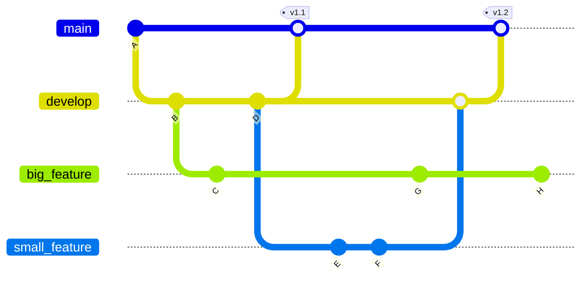
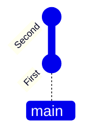
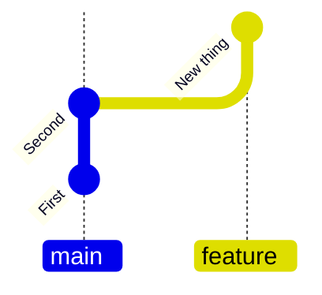
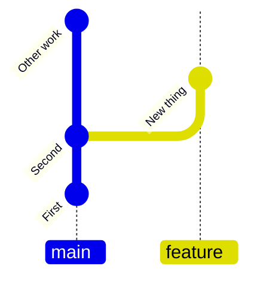
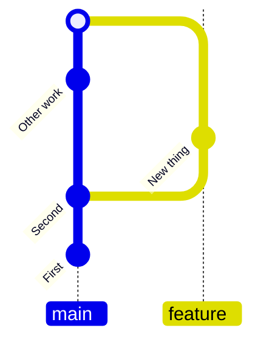

## Part 1: Why software needs collaboration

---
layout: two-cols
---

# Software development is ongoing

- Software is never "finished"
- Bugs are discovered over time
- New requirements and improvements emerge

::right::

  

---
layout: two-cols
---

# Knowing about problems is not enough

- Issues must be recorded somewhere shared
- They need prioritisation and ownership
- Decisions need context and history
- That is what **issue tracking** provides:
  - A shared list of tasks, bugs, and ideas
  - A place for discussion and decisions
  - A record of what was done and why

::right::

  
  

---
layout: default
---

# Parallel work and code review

- Multiple contributors working on the same codebase
- Working in parallel on separate changes
- Reviewing each other's work before integration

  

 
 
 

  
<b>Linux kernel</b> >11000 contributors

  
<b>Kubernetes</b> >9000 contributors

  
<b>VS Code</b> >2400 contributors

  
<b>NumPy</b> >1800 contributors

  
<b>SciPy</b> >1700 contributors

---
layout: section
title: " "
---

## Part 2: Platforms enable these practices

---

# From collaboration practices to tools

- Issue tracking is a practice
- Parallel work is a practice
- Code review is a practice

 
 

<v-click>

  <h3><b>Tools exist to support these practices at scale</b></h3>

</v-click>

---
layout: two-cols
---

# Collaborating without platforms

Email patches on mailing lists.

- Run `diff` against a known version, paste output into an email
- Maintainers apply the patch manually (`git am`)
- Still used today:
  - the Linux kernel
  - Git
  - PostgreSQL

::right::

  

---
layout: two-cols
---

# Why do we focus on GitHub

- **Hosting + issues + forks + PRs in one platform** --- earlier tools
  (gitweb, cgit, Gitorious) were either browse-only or single-feature
- **Free repositories** --- no cost barrier for a first project
- **Community adoption** --- once it gained traction from the open-source community, the momentum continues
- Alternatives:
  - GitLab (GNOME, freedesktop.org)
  - Codeberg (Zig, from Nov 2025)

::right::

  
  
GitHub Octoverse 2025

---

# Project management with GitHub

- "GitHub Issues" are an implementation of issue tracking
- "Mentions" are a communication mechanism
- "Labels" categorise issues
- "Milestones" group issues/PRs with a common goal (e.g. a release)

  
  

---

# Git branches enable parallel workflows

::center

**Git implements parallel work using branches.**

 

---

# Git branches + feature branch workflow

Commit to main branch

Create a new branch, make commits to it

Changes independent of main branch

Merge commit

- Main branch for tested, stable code, feature branches for new, separate units of work
- Keeps main branch stable, allows independent work on features
- Easy to discard unwanted features

---

# Collaborative code development models

::center
<b>Different projects balance control and openness differently</b>
::

  

    
Shared repository model

    
(common in private projects)

    
  

  <v-click >
    

      
Fork and pull model

      
(popular in open-source)

      
    

  </v-click>

---
layout: two-cols
---

# Pull requests: a tool for review and integration

- Propose changes for review
- Discuss and refine work
- Run automated checks on changes
- Integrate approved changes safely

::right::

::center

::

---
layout: two-cols
---

# Advantages of code review

- Identifies defects early in the process
- Catches bugs before they reach production
- Enhances team learning and collaboration

::right::

::center

::

---

# Adding code via GitHub pull requests

- Discuss and review changes
- Add follow-up commits based on feedback
- Merge changes from feature branch to base branch

  

---

# There's more to GitHub

- **GitHub Pages**: publish a project website straight from a repository
  - Great for documentation and small project sites
- **GitHub Releases**: tag a commit, attach build artefacts, write
  release notes --- a permanent versioned snapshot
- **GitHub Actions**: CI/CD that runs on every push or PR
- **Draft pull requests**: share work-in-progress without it being treated as
  ready to merge
- **Branch protection**: block direct pushes to `main`, require reviews before
  merge
- **Sub-issues, issue types, GitHub Projects**: issue tracking with more
  structure
- **GitHub Discussions**: questions, ideas, networking

---
layout: two-cols
---

# Be a helpful and nice person!

- **Search before posting** --- your problem may already be reported.
- **Read the contribution guidelines**
- **Write clear bug reports**
  - what you ran
  - what happened
  - what you expected
  - the version you were on
  - with a minimal example to demonstrate the bug
- **Tone matters**: the people on the other side are real people!
- **AI usage**: do not inundate people with AI-generated issues/feature
  requests

::right::

  
  
Don't do this!

---

# Learning objectives

- Use the feature branch workflow to collaborate with others on the same repository
- Learn about code reviews and pull requests on GitHub
- Understand and create GitHub issues to manage bug reports and feature requests

---

# Example GitHub repository

  <h3><b>C</b>ancer, <b>H</b>eart <b>a</b>nd <b>S</b>oft <b>T</b>issue <b>E</b>nvironment</h3>
  
  <a href="https://github.com/Chaste/Chaste">https://github.com/Chaste/Chaste</a>

