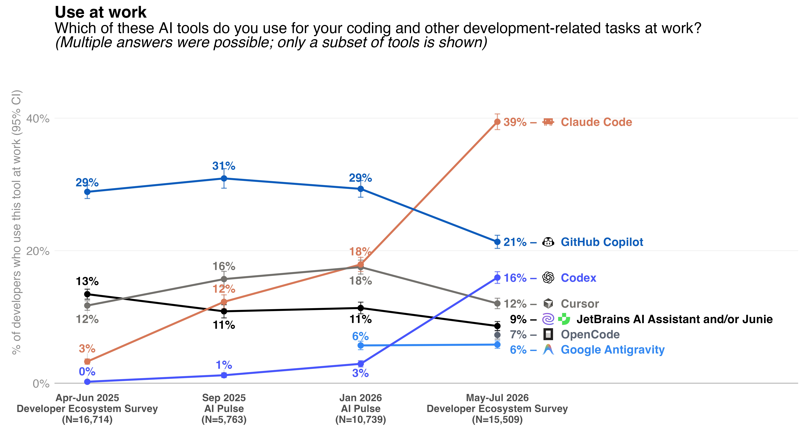
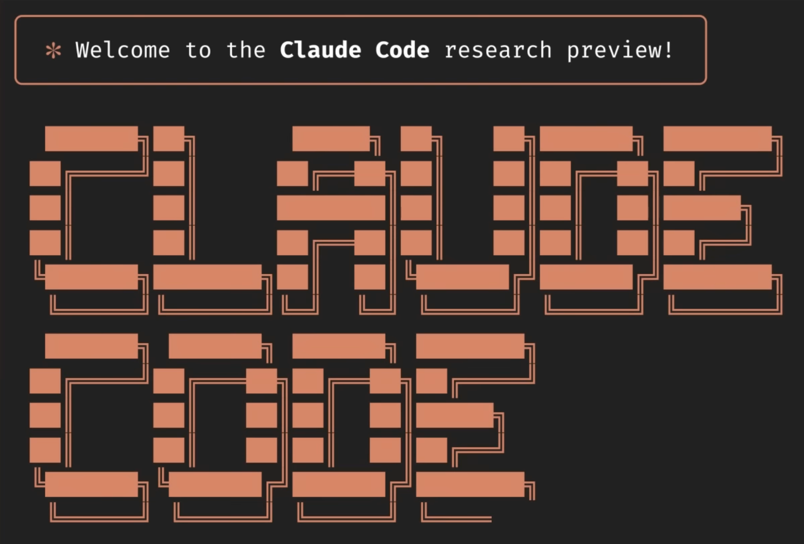

# What is a coding agent

::left::

> A coding agent is a piece of software that acts as a **harness** for an LLM,
> extending that LLM with additional capabilities that are powered by invisible
> prompts and implemented as callable tools.

Simon Willison, <a href="https://simonwillison.net/guides/agentic-engineering-patterns/how-coding-agents-work/">"How coding agents work"</a>

agent = model + harness

::right::

- **Model**: the underlying LLM
- **Harness**: everything around the model:
  - **loop**: run a tool, feed the result back, and repeat
  - **tools**: read and edit files, inspect commit history, run your tests
    etc.
  - **context management**: compact, handle caches
  - **guardrails**: what it can and cannot do

::bottom::

Harness components after Anthropic, <a href="https://claude.com/blog/harnessing-claudes-intelligence">"Agent harness design"</a>, 2 April 2026.

---
layout: two-cols-header
---

# Modern coding agents

::left::

- **Copilot** (2021): inline suggestions
- **Aider** (2023), **Cursor** (2024): instruction files, slash commands
- **Claude Code** (2025): subagents, hooks, skills
- Later coding agents such as **Codex CLI**, **OpenCode**, **Copilot CLI**,
  **Antigravity** etc. are heavily influenced by Claude Code.

JetBrains, <a href="https://blog.jetbrains.com/research/2026/08/ai-coding-agent-adoption-2026/">AI coding agent adoption</a>, August 2026 (15,509 developers surveyed May-July 2026).

::right::

---

# Obstacles to using coding agents

- It does not do what you intended.
- It goes further than you asked.
- It claims everything is working but they aren't!
- It produces more code than you can meaningfully read and review.
- It deviates from its initial goal.

  
Violates an explicit developer constraint

  

  
38.3%

  
Acts on a wrong interpretation of what was requested

  

  
27.0%

  
Misreports the status (e.g. success) of its own work

  

  
22.6%

  
Produces code that is logically or syntactically incorrect

  

  
17.8%

  
Misreads the codebase, system state or technical behaviour

  

  
11.6%

  
Takes actions beyond the stated scope

  

  
10.2%

  
Commands or tool calls are operationally malformed

  

  
2.9%

N. Tang et al., "How coding agents fail their users", <a href="https://arxiv.org/abs/2605.29442">arXiv:2605.29442</a> (2026), <a href="https://arxiv.org/html/2605.29442v2#S4.T3">Table 3</a>.

---

# Learning objectives

The practical session has four modules:

1. Know how to prompt an agent the context, the boundaries and the success
   conditions it needs.
2. Judge whether a bug report is written well enough for an agent to act on at
   all.
3. Decide whether a feature should exist at all, then say what must exist, what
   must not change, and what counts as done.
4. Familiarise yourself with code you did not write (or written by yourself
   5 years ago).
