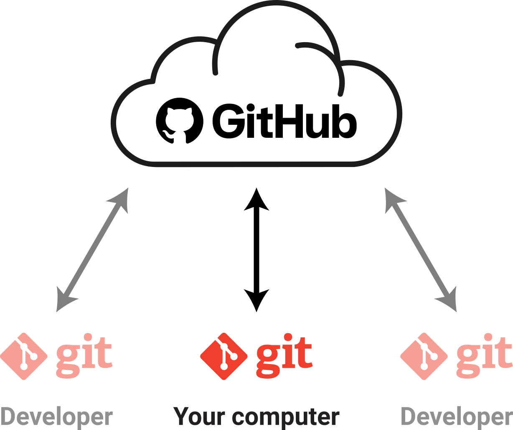
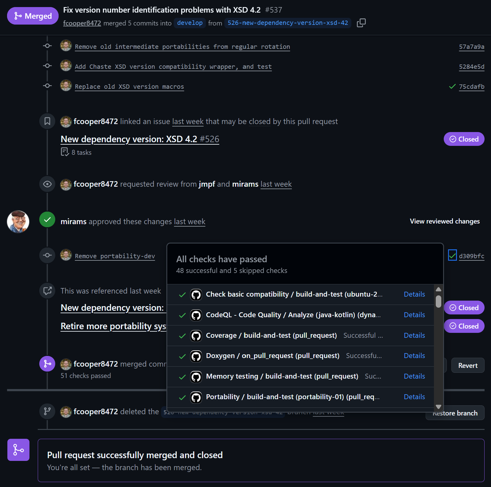
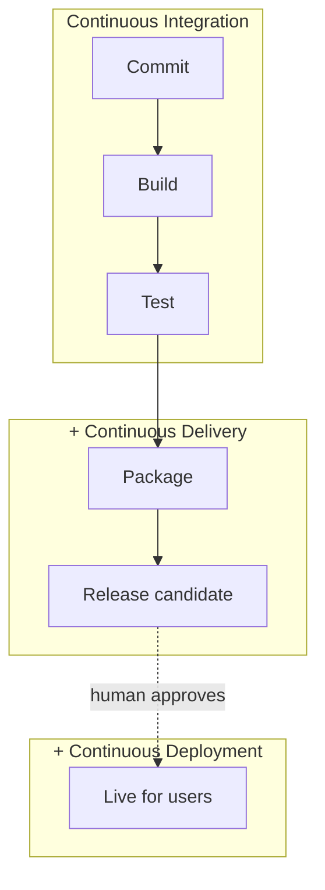
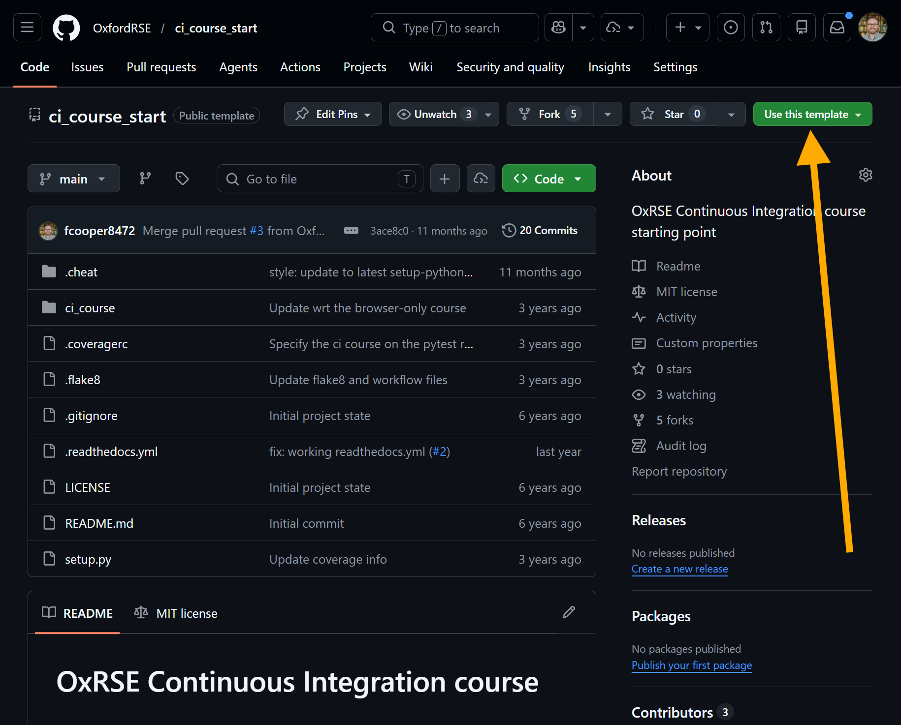

---

```yaml
layout: orientation
title: Orientation
highlight: Continuous Integration
training-event-only: true
```

---
layout: default
---

# Introduction to Continuous Integration (CI)

<v-clicks>

- **Continuous Integration (CI)** is an automated process for verifying and integrating code changes
- Objective: detect and resolve issues early by frequently testing and integrating code changes
- Helps ensure **compatibility**, **functionality**, and reduces unexpected problems
- Once you trust the tests, **Continuous Delivery / Deployment (CD)** automates what happens next

</v-clicks>

<style>
    ul { @apply flex flex-col h-100 justify-evenly text-xl }
</style>

---
layout: two-cols
---

# Challenges without CI

<div class="text-base opacity-70 mb-3">Why not just run the tests yourself before you push?</div>

<v-clicks>

- **Compatibility**: ensuring code works across different operating systems, software versions, and hardware
- **Consistency**: avoiding hidden dependencies on user data or machine-specific configuration
- **Collaboration**: managing code changes from multiple developers without conflict

</v-clicks>

<style>
    ul { @apply flex flex-col h-90 justify-evenly text-xl }
</style>

::right::
<div class="pl-4 pt-8">
  <p class="mb-3 text-sm font-semibold tracking-wide text-gray-600">
    Same codebase, different outcomes across platforms
  </p>
  <table class="w-full text-base border-separate border-spacing-1">
    <thead>
      <tr class="text-white">
        <th class="bg-gray-500 p-2"></th>
        <th class="bg-gray-500 p-2 font-semibold">Ubuntu</th>
        <th class="bg-gray-500 p-2 font-semibold">Windows</th>
        <th class="bg-gray-500 p-2 font-semibold">MacOS</th>
      </tr>
    </thead>
    <tbody>
      <tr>
        <td class="bg-gray-200 p-2 text-left">Python 3.14</td>
        <td class="bg-gray-200 p-2 text-center text-green-500 text-2xl">&#10003;</td>
        <td class="bg-gray-200 p-2 text-center text-pink-500 text-2xl">&#10007;</td>
        <td class="bg-gray-200 p-2 text-center text-green-500 text-2xl">&#10003;</td>
      </tr>
      <tr>
        <td class="bg-gray-100 p-2 text-left">Python 3.13</td>
        <td class="bg-gray-100 p-2 text-center text-green-500 text-2xl">&#10003;</td>
        <td class="bg-gray-100 p-2 text-center text-green-500 text-2xl">&#10003;</td>
        <td class="bg-gray-100 p-2 text-center text-green-500 text-2xl">&#10003;</td>
      </tr>
      <tr>
        <td class="bg-gray-200 p-2 text-left">Python 3.12</td>
        <td class="bg-gray-200 p-2 text-center text-green-500 text-2xl">&#10003;</td>
        <td class="bg-gray-200 p-2 text-center text-green-500 text-2xl">&#10003;</td>
        <td class="bg-gray-200 p-2 text-center text-green-500 text-2xl">&#10003;</td>
      </tr>
      <tr>
        <td class="bg-gray-100 p-2 text-left">Python 3.11</td>
        <td class="bg-gray-100 p-2 text-center text-green-500 text-2xl">&#10003;</td>
        <td class="bg-gray-100 p-2 text-center text-green-500 text-2xl">&#10003;</td>
        <td class="bg-gray-100 p-2 text-center text-green-500 text-2xl">&#10003;</td>
      </tr>
    </tbody>
  </table>
</div>

---
layout: two-cols
---

# Key principles of CI

<div class="text-base opacity-70 mb-3">What a working pipeline assumes</div>

<v-clicks>

- **Single source repository**: code and dependencies in a shared repository
- **Automated builds**: compile, package, and create installers automatically
- **Self-testing builds**: automated tests run after each build to validate functionality

</v-clicks>

<style>
    ul { @apply flex flex-col h-90 justify-evenly text-xl }
</style>

::right::
<div class="pl-4 flex items-center justify-center h-full">
  
</div>

---
layout: two-cols
---

# Key principles of CI (continued)


<div class="h-full flex items-center justify-left">
  
</div>

::right::

<v-clicks>

- **Frequent commits**: integrate changes regularly to avoid complex merge conflicts
- **Use an integration machine**: run builds and tests in a standardised, clean environment
- **Visibility and transparency**: make build and test results accessible to the whole team

</v-clicks>

<style>
    ul { @apply flex flex-col h-100 justify-evenly text-xl }
</style>


---
layout: two-cols
---

# From integration to delivery

<div class="text-base opacity-70 mb-3">CI confirms that a change is suitable. What happens next?</div>

<v-clicks>

- **Continuous Delivery**: every change that passes is _prepared_ for release --- a human still decides when
- **Continuous Deployment**: the approval step goes away, and passing changes go live automatically
- Delivery and Deployment differ by one thing: **whether a human approves**

</v-clicks>

<style>
    ul { @apply flex flex-col h-90 justify-evenly text-lg }
</style>

::right::

<div class="pl-4 flex items-center justify-center h-full">



</div>

---

# Continuous Integration and Delivery tools

<v-clicks>

<div class="flex items-center gap-4 py-2">
  
  <p class="m-0"><strong>GitHub Actions</strong>: CI/CD built into GitHub &mdash; what we will use today</p>
</div>

<div class="flex items-center gap-4 py-2">
  
  <p class="m-0"><strong>GitLab CI/CD</strong>: the equivalent where an institution hosts its own GitLab</p>
</div>

<div class="flex items-center gap-4 py-2">
  
  <p class="m-0"><strong>Jenkins</strong>: self-hosted and long-established, common in secure data environments</p>
</div>

<p class="pt-2 opacity-70">Historical tools: Travis CI and AppVeyor - have largely been displaced</p>

<p class="pt-1">The YAML differs but the principles are the same &mdash; <strong>triggers</strong>, <strong>jobs</strong>, <strong>runners</strong> and <strong>steps</strong> exist in all of them</p>

</v-clicks>

<style>
    p { @apply text-xl }
</style>

---
layout: section
title: " "
---

## Setting it up

---
layout: two-cols
---

# Basic GitHub Actions

<div class="pr-4">

<ul class="space-y-3">
  <li v-click="1">Workflows are defined in YAML</li>
  <li v-click="2">
    Common triggers:
    <ul class="mt-2">
      <li><code>push</code></li>
      <li><code>pull_request</code></li>
      <li><code>workflow_dispatch</code></li>
    </ul>
  </li>
  <li v-click="3">Jobs run on specified runners such as <code>ubuntu-latest</code></li>
  <li v-click="4">Each job contains one or more <strong>steps</strong></li>
</ul>

</div>

::right::
<div class="pl-4 pt-6">

```yaml {1-13|1-13|3-6|8-10|11-13}
name: Hello World

on:
  push:
  pull_request:
  workflow_dispatch:

jobs:
  basic-job:
    runs-on: ubuntu-latest
    steps:
      - name: Run a one-line script
        run: echo "Hello, world!"
```

</div>

---
layout: two-cols
---

# A deployment workflow

<div class="pr-4">

<ul class="space-y-3">
  <li v-click="1">Same skeleton: <code>on</code>, <code>jobs</code>, <code>steps</code></li>
  <li v-click="2">Only merged code goes live &mdash; <code>branches: [main]</code></li>
  <li v-click="3">The job gets a <strong>scoped token</strong>, not blanket access</li>
  <li v-click="4"><code>run</code> is your own command; <code>uses</code> pulls in a prewritten action</li>
  <li v-click="5">No human gate here, so this is Continuous <strong>Deployment</strong></li>
</ul>

<p class="pt-3 text-sm opacity-70">In the course you will use Read the Docs, which watches the repository and rebuilds on push &mdash; same idea, different runner.</p>

</div>

::right::
<div class="pl-4 pt-2">

```yaml {1-23|1-23|3-5|7-10|17-23|1-23}
name: Deploy docs

on:
  push:
    branches: [main]

permissions:
  contents: read
  pages: write
  id-token: write

jobs:
  deploy:
    runs-on: ubuntu-latest
    environment: github-pages
    steps:
      - uses: actions/checkout@v4
      - run: pip install .[docs]
      - run: sphinx-build -b html docs _build/html
      - uses: actions/upload-pages-artifact@v3
        with:
          path: _build/html
      - uses: actions/deploy-pages@v4
```

</div>

<style>
    .slidev-layout pre.slidev-code,
    .slidev-layout pre.slidev-code code {
      font-size: 0.68rem !important;
      line-height: 1.45 !important;
    }
</style>

---

# This course

### Hands-on setup of CI for a small **Python** project using **GitHub Actions**

<v-clicks>

- Introduction to **GitHub Actions**
- Generating **code coverage** information
- Creating and deploying **documentation** --- your first taste of **CD**

</v-clicks>

<style>
    ul { @apply flex flex-col h-100 justify-evenly text-xl }
</style>

---
layout: two-cols
---

# Getting started with the course

<v-clicks>

- Visit the [**GitHub Template Repository**](https://github.com/OxfordRSE/ci_course_start)
- Click **Use this template** and create a new repository
- Name the repository
- Clone it to your local machine
- Continue to follow the course online for further instructions

</v-clicks>

<style>
    ul { @apply flex flex-col h-100 justify-evenly text-xl }
</style>

::right::

<div class="h-full flex items-center justify-right">
  
</div>


---

```yaml
layout: questions
training-event-only: true
```

---

```yaml
src: ../../epilogue/main.md
training-event-only: true
```
