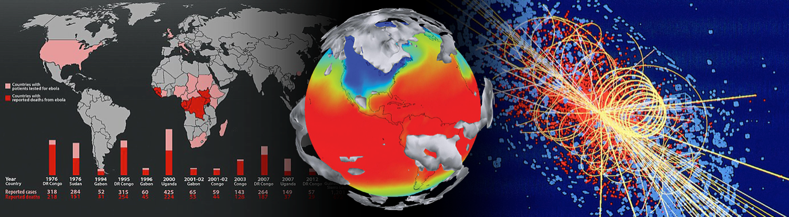
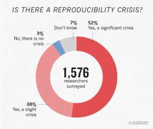
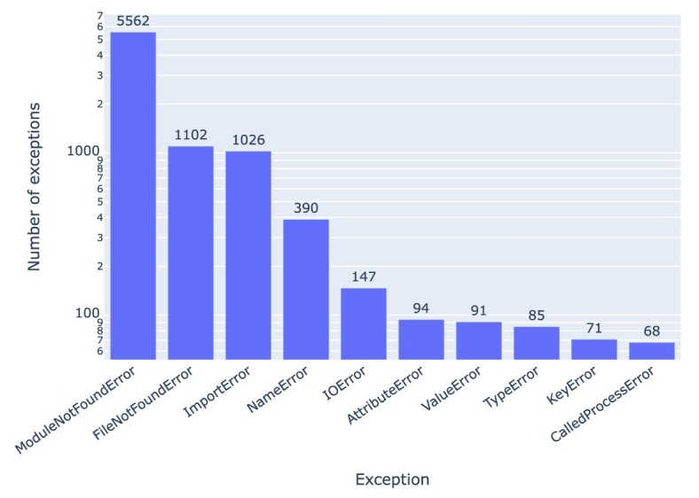
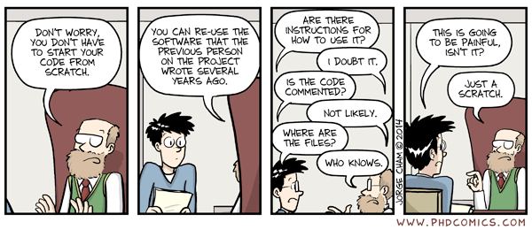
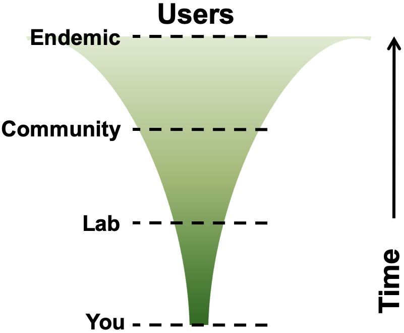
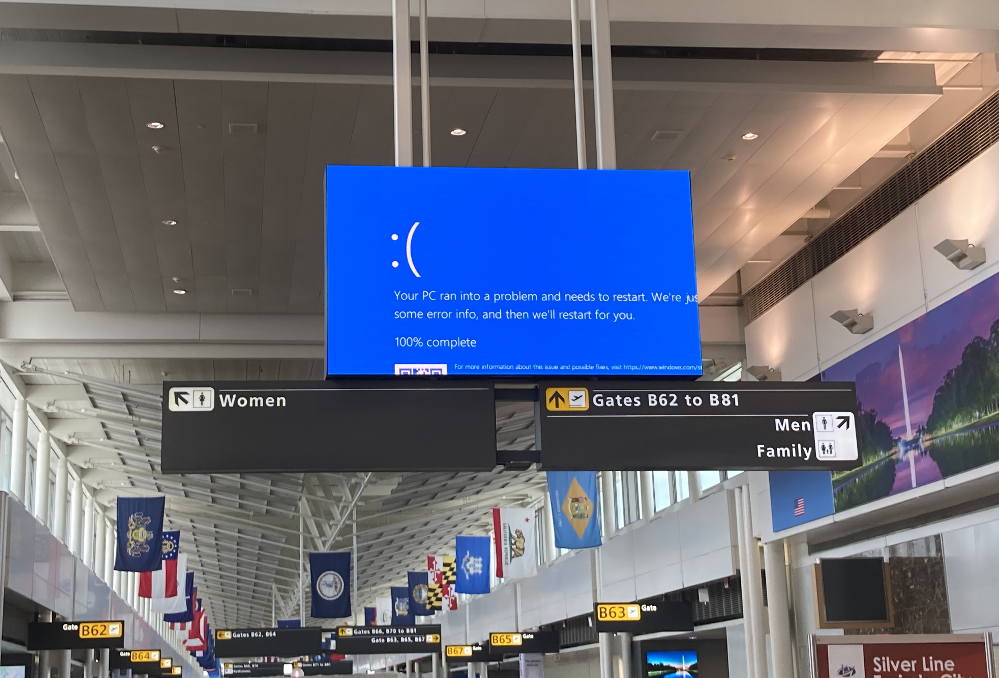
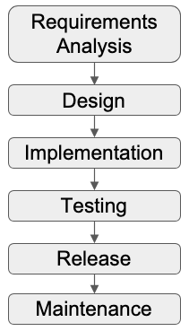
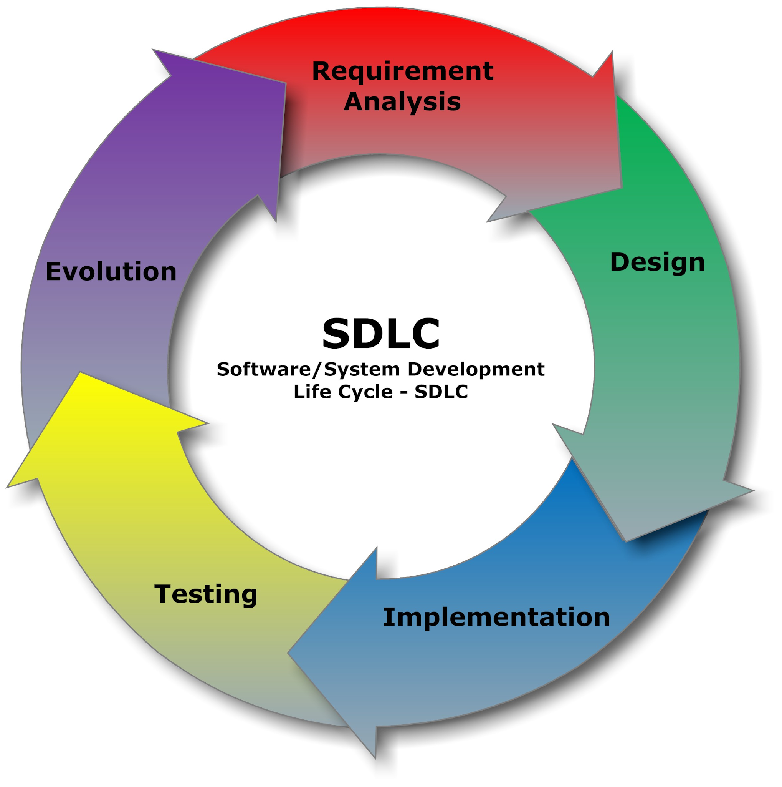
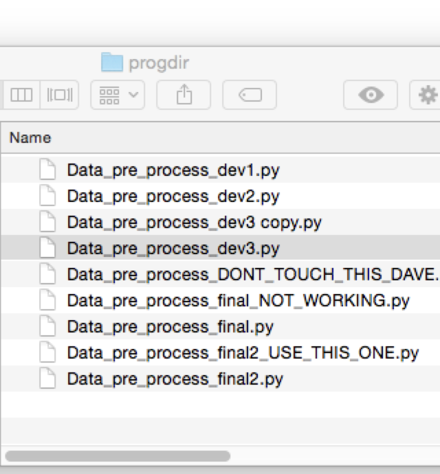
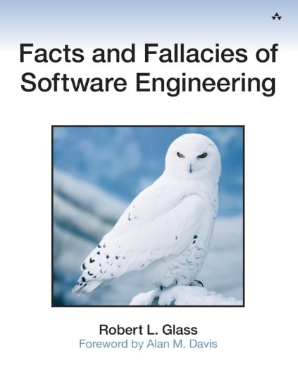

---

```yaml
layout: orientation
title: Orientation
highlight: Course Introduction
training-event-only: true
```

---
layout: center
---

# Introduction

::center

## Why <span v-mark.underline.orange="1">engineer</span> research software?

::

---
layout: center
---

# Research is impossible without software



From thrown-together scripts, through an abundance of complex spreadsheets, to the millions of lines of code behind large-scale infrastructure, there are few areas where software does not play a fundamental part in research

<!--
'Not MY software'... 'Doesnt affect my scripts on my desktop' lets think about what the lifecycle of those scripts are...

Your software (experiments, analysis, meta analyses, visualisation) produces the results for articles from your lab

Articles are picked up by news agencies and government policy advisories to shape public opinion and government policy

Need to ensure transparency, reproducibility, potential for expansion and collaboration, correctness

Quite scary - suddenly a great emphasis on your code; you want it to be correct, you need it to be well documented.. Or even yourself in 6 months when your writing up

Make life easy for yourself NOW and structure your code
-->

---
layout: two-cols-header
---

# Reproducibility in research

::left::

<div class="h-10"></div>

- **52%** of researchers agree there is a significant crisis of reproducibility
- More than **70%** have tried and failed to reproduce another scientist's experiment
  - And more than half have failed to even reproduce their own!

<v-click>

Modern research increasingly relies on software, so what about the code behind it?

</v-click>

::right::

::center
<div class="h-15"></div>

::

::bottom::

<div class="text-sm opacity-60">
M. Baker, "1,500 scientists lift the lid on reproducibility", <i>Nature</i> <b>533</b>, 452-454 (2016). <a href="https://doi.org/10.1038/533452a">doi:10.1038/533452a</a>
</div>

---
layout: two-cols-header
---

# Why should we care about software?

::left::

<div class="h-10"></div>

- 27271 Jupyter notebooks from 3467 biomedical papers
- 22578 were Python and only **1203** ran to completion
- Only **879** reproduced the original results

<v-click>

Only **3.9%** of the Python notebooks could be rerun to reproduce the original results.

</v-click>

::right::

::center
<div class="h-10"></div>

::

::bottom::

<div class="text-sm opacity-60">
S. Samuel and D. Mietchen, "Computational reproducibility of Jupyter notebooks from biomedical publications", <i>GigaScience</i> <b>13</b>, giad113 (2024). <a href="https://doi.org/10.1093/gigascience/giad113">doi:10.1093/gigascience/giad113</a>.
</div>

---
layout: center
transition: "none"
---

# Idealised research software lifecycle

::center

<div class="relative h-90 w-140">

  <!-- Cascading boxes -->
  <div class="absolute top-0 left-0 inline-block border border-gray-400 px-3 py-1 rounded shadow">
    Research Questions
  </div>

  <div class="absolute top-16 left-16 inline-block border border-gray-400 px-3 py-1 rounded shadow">
    Develop Software
  </div>

  <div class="absolute top-32 left-32 inline-block border border-gray-400 px-3 py-1 rounded shadow">
    Run Software
  </div>

  <div class="absolute top-48 left-48 inline-block border border-gray-400 px-3 py-1 rounded shadow">
    Analyse Data
  </div>

  <div class="absolute top-64 left-64 inline-block border border-gray-400 px-3 py-1 rounded shadow">
    Publish Paper
  </div>

  <div class="absolute top-80 left-80 inline-block border border-gray-400 px-3 py-1 rounded shadow">
    Project Ends
  </div>

  <FancyArrow x1="20" y1="40" x2="60" y2="84" arc="-0.4" head-size="15" />
  <FancyArrow x1="85" y1="105" x2="125" y2="150" arc="-0.4" head-size="15" />
  <FancyArrow x1="150" y1="170" x2="190" y2="212" arc="-0.4" head-size="15" />
  <FancyArrow x1="210" y1="230" x2="255" y2="275" arc="-0.4" head-size="15" />
  <FancyArrow x1="270" y1="295" x2="320" y2="340" arc="-0.4" head-size="15" />

</div>

::

<!--
'Waterfall' model

Highly unrealistic; also treats software developed as disposable

Software increasingly DEMANDED to be open access published by journals, reproduce your results

With pressure to published, there has been a reproducilbiity crisis in science
-->

---
layout: center
---

# In reality...

::center

<div class="relative h-90 w-140">

  <!-- Cascading boxes -->
  <div class="absolute top-0 left-0 inline-block border border-gray-400 px-3 py-1 rounded shadow">
    Research Questions
  </div>

  <div class="absolute top-16 left-16 inline-block border border-gray-400 px-3 py-1 rounded shadow">
    Develop Software
  </div>

  <div class="absolute top-32 left-32 inline-block border border-gray-400 px-3 py-1 rounded shadow">
    Run Software
  </div>

  <div class="absolute top-48 left-48 inline-block border border-gray-400 px-3 py-1 rounded shadow">
    Analyse Data
  </div>

  <div class="absolute top-64 left-64 inline-block border border-gray-400 px-3 py-1 rounded shadow">
    Publish Paper
  </div>

  <div class="absolute top-80 left-80 inline-block border border-gray-400 px-3 py-1 rounded shadow">
    Project Ends
  </div>

  <div class="absolute top-77 left-130 inline-block border border-gray-400 px-3 py-1 rounded shadow">
    Graceful Decline
  </div>

  <!-- Forward paths -->
  <FancyArrow x1="20" y1="40" x2="60" y2="84" arc="-0.4" head-size="15" />
  <FancyArrow x1="85" y1="105" x2="125" y2="150" arc="-0.4" head-size="15" />
  <FancyArrow x1="150" y1="170" x2="190" y2="212" arc="-0.4" head-size="15" />
  <FancyArrow x1="210" y1="230" x2="255" y2="275" arc="-0.4" head-size="15" />
  <FancyArrow x1="270" y1="295" x2="320" y2="340" arc="-0.4" head-size="15" />
  <FancyArrow x1="462" y1="340" x2="517" y2="340" head-size="15" />

  <div class="absolute top-40 left--40 inline-block border border-gray-400 px-3 py-1 rounded shadow">
    Project Partners
  </div>
  <div class="absolute top-60 left--10 inline-block border border-gray-400 px-3 py-1 rounded shadow">
    Industry
  </div>
  <div class="absolute top-80 left-10 inline-block border border-gray-400 px-3 py-1 rounded shadow">
    Other People
  </div>


  <!-- Project partners -->
  <FancyArrow x1="-70" y1="155" x2="-5" y2="15" arc="0.4" head-size="15" color="gray" />
  <FancyArrow x1="-40" y1="200" x2="125" y2="150" arc="-0.3" head-size="15" color="gray"/>
  <FancyArrow x1="-70" y1="155" x2="60" y2="84" arc="0.4" head-size="15" color="gray"/>
  <FancyArrow x1="-40" y1="200" x2="190" y2="212" arc="-0.2" head-size="15" color="gray"/>

  <!-- Industry -->
  <FancyArrow x1="0" y1="235" x2="-5" y2="15" arc="0.4" head-size="15" color="gray"/>
  <FancyArrow x1="0" y1="235" x2="125" y2="150" arc="-0.3" head-size="15" color="gray"/>
  <FancyArrow x1="0" y1="235" x2="60" y2="84" arc="0.4" head-size="15" color="gray"/>
  <FancyArrow x1="60" y1="260" x2="190" y2="212" arc="-0.2" head-size="15" color="gray"/>

  <!-- Other people -->
  <FancyArrow x1="120" y1="320" x2="-5" y2="15" arc="0.4" head-size="15" color="gray"/>
  <FancyArrow x1="120" y1="320" x2="125" y2="150" arc="-0.3" head-size="15" color="gray"/>
  <FancyArrow x1="120" y1="320" x2="60" y2="84" arc="0.4" head-size="15" color="gray"/>
  <FancyArrow x1="120" y1="320" x2="190" y2="212" arc="-0.2" head-size="15" color="gray"/>

  <!-- Backpaths -->
  <FancyArrow x1="430" y1="315" x2="205" y2="15" arc="-0.4" head-size="15" color="gray"/>
  <FancyArrow x1="370" y1="250" x2="205" y2="15" arc="-0.4" head-size="15" color="gray"/>
  <FancyArrow x1="370" y1="250" x2="250" y2="80" arc="-0.4" head-size="15" color="gray"/>
  <FancyArrow x1="300" y1="190" x2="250" y2="80" arc="-0.4" head-size="15" color="gray"/>
  <FancyArrow x1="300" y1="190" x2="205" y2="15" arc="-0.4" head-size="15" color="gray"/>
  <FancyArrow x1="250" y1="125" x2="250" y2="80" arc="-0.4" head-size="15" color="gray"/>
  <FancyArrow x1="85" y1="105" x2="255" y2="275" arc="-0.4" head-size="15" color="gray"/>

</div>

<div v-click class="absolute top-30 left-130 text-left inline-block border border-gray-400 px-3 py-1 rounded shadow bg-white dark:bg-black">
  What happens when...
  <ul>
  <li>You have a follow-on project?</li>
  <li>Someone else wants to use your code?</li>
  <li>Someone wants to reproduce your results?</li>
  </ul>
</div>

::

<!--
Project partners: MSc, undergrad, different version of software

End of process of continual iteration we publish a paper; even then the software doesnt die, supports the lab for the next 5-10 years in various guises.
-->

---
layout: center
---

# Legacy code

::center

::

<v-clicks at="0" every="2">

- What are your experiences re-running or adjusting a script you created few months ago?
- Have you continued working from a previous student's code?
- Are you afraid to alter existing code for fear of it breaking?

</v-clicks>

---
layout: two-cols-header
---

# The software you write is important!

::left::

- Software inherently contains value
  - Produces results, contains lessons learnt, effort

- Difficult to gauge to what extent it might be used in the future
  - By who?
  - Which parts?
  - Which projects?
  - Reproducibility -- from publications!

Can it / should it be reusable by others... including yourself?

::right::

::center
<div class="h-15"></div>

::

---
layout: two-cols-header
---

# Ariane-5

::left::

- 4 June 1996: Ariane 5 flight 501
- $7 billion development
- At least $370 million lost
- Used Ariane 4 code

<v-click>
<div class="absolute top-65 left-10 inline-block border border-gray-400 px-3 py-1 rounded shadow">
Loss of guidance & altitude info
</div>
</v-click>

<v-click>
<FancyArrow x1="50" y1="300" x2="60" y2="340" arc="-0.4" head-size="15" color="black"/>
<div class="absolute top-85 left-15 inline-block border border-gray-400 px-3 py-1 rounded shadow">
64-bit fp converted to 16-bit signed integer
</div>
</v-click>

<v-click>
<FancyArrow x1="70" y1="380" x2="80" y2="420" arc="-0.4" head-size="15" color="black"/>
<div class="absolute top-105 left-20 inline-block text-red border border-red-400 px-3 py-1 rounded shadow">
<b>BOOM!</b>
</div>
</v-click>

::right::

::center

::

---
layout: two-cols-header
---

# CrowdStrike Falcon

::left::

- 19 July 2024: routine data update to security software in Windows
- 8.5 million machines crashed, some down for days
- Estimated loss of $5.4 billion by the US Fortune 500

<v-click>
<div class="absolute top-56 left-10 inline-block border border-gray-400 px-3 py-1 rounded shadow">
Spec said 21 values and it was given 20
</div>
</v-click>

<v-click>
<FancyArrow x1="50" y1="264" x2="60" y2="296" arc="-0.4" head-size="15" color="black"/>
<div class="absolute top-74 left-15 inline-block border border-gray-400 px-3 py-1 rounded shadow">
Update asked to match the 21st
</div>
</v-click>

<v-click>
<FancyArrow x1="70" y1="336" x2="80" y2="368" arc="-0.4" head-size="15" color="black"/>
<div class="absolute top-92 left-20 inline-block text-red border border-red-400 px-3 py-1 rounded shadow">
<b>No bounds check and Windows crashed</b>
</div>
</v-click>

::right::

::center

::

::bottom::

<v-click>

**All these checks are standard in modern software engineering.**

</v-click>

<div class="text-sm opacity-60">
CrowdStrike, "External Technical Root Cause Analysis: Channel File 291", 6
August 2024; Microsoft, D. Weston, 20 July 2024. Parametrix, "CrowdStrike's
Impact on the Fortune 500", 24 July 2024.  </div>

<style>
.two-cols-header {
  grid-template-columns: 64% 36% !important;
}
</style>

---
layout: two-cols-header
---

# Programming vs Engineering

::left::

<br>

## Programming / Coding

<br>

- Focus is on one aspect of software development
- Writes software for themselves
- Mostly an individual activity
- Writes software to fulfil research goals (ideally from a design)

::right::

<br>

## Engineering

<br>

- Considers the lifecycle of software
- Writes software for stakeholders
- Takes team ethic into account
- Applies a process to understanding, designing, building, releasing, and maintaining software

<v-click>
<div class="absolute top-100 left-70 inline-block border border-gray-400 px-3 py-1 rounded shadow bg-white dark:bg-black">
<i>Programmers tend to start coding right away.<br>Sometimes this works.</i> - Eric Larsen, 2018
</div>
</v-click>

---
layout: center
---

# Where are you?

<div class="relative h-90 w-150">

  <!-- Line labels -->
  <div class="absolute left-0 top-40 text-red-500">
    <b>Software<br/>Engineering</b>
  </div>

  <div class="absolute left-138 top-43 text-blue-500">
    <b>Research</b>
  </div>

  <!-- Centre line -->
  <div class="absolute left-30 top-46 w-50 h-1 bg-red-500"></div>
  <div class="absolute left-30 top-45 w-3 h-3 bg-red-500 rounded-full"></div>
  <div class="absolute left-80 top-46 w-50 h-1 bg-blue-500"></div>
  <div class="absolute left-130 top-45 w-3 h-3 bg-blue-500 rounded-full"></div>

  <!-- Here -->
  <div class="absolute left-74 top-20 text-xl">
    <b>Here</b>
  </div>
  <Arrow x1="320" y1="110" x2="320" y2="180" head-size="15" color="black"/>

  <!-- Software engineer -->
  <div class="absolute left-22 top-64 text-gray-500">
    Software<br/>engineer
  </div>
  <Arrow x1="126" y1="255" x2="126" y2="195" head-size="15" color="gray"/>

  <!-- Research developer -->
  <div class="absolute left-97 top-64 text-gray-500">
    Research<br/>developer
  </div>
  <Arrow x1="426" y1="255" x2="426" y2="195" head-size="15" color="gray"/>

  <!-- Researcher -->
  <div class="absolute left-120 top-24 text-gray-500">
    Researcher
  </div>
  <Arrow x1="526" y1="122" x2="526" y2="177" head-size="15" color="gray"/>

</div>

---
layout: two-cols-header
---

# Beyond building a 'sequence of instructions'

::left::

Software is far more than that...

- **Outcome of a development process**

But also...

- Architecture
- Implementation of algorithms
- Data model
- Documentation
- *Best practices and conventions...*

::right::

<div class="grid grid-cols-2 gap-8 w-full h-full">
  <div class="flex flex-col items-center text-center">
    <h2 class="text-2xl font-semibold mb-4">Waterfall</h2>
    
  </div>
  <div class="flex flex-col items-center text-center">
    <h2 class="text-2xl font-semibold mb-4">Agile</h2>
    
  </div>
</div>

---

# Testing

- Humans are fallible! Our software *will* contain defects
  - In requirements, design, as well as code
  - 1-10-150 hours to fix in design/development/production

- **Verification:** are we building the *product right*?
  - Does the code do what the design says? Unit testing, automated testing,
    code review
- **Validation:** are we building the *right product*?
  - Do the design and its results answer the research question?

<v-click>

Verified but not validated: a flawless software that doesn't solve the actual
problem

</v-click>

---
layout: two-cols-header
---

# When defects reach the literature

::left::

- **Protein structures, 2001--2005.** An internal software utility flipped two
  columns of data, inverting the electron-density map used to derive the
  structures. Five papers retracted.

- **Gene names in Excel, 2016.** Default autocorrection and locale settings
  turn genes such as 'MEI1' to 'May-01' (Dutch 'mei'). Errors found in the
  supplementary files of **19.6%** of papers surveyed, and **30.9%** by 2021.

::right::


*"I didn't question it then. Obviously now I check it all the time."* - Geoffrey Chang

::bottom::

<div class="text-sm opacity-60">
G. Miller, <i>Science</i> <b>314</b>, 1856-1857 (2006). M. Ziemann et al., <i>Genome Biol.</i> <b>17</b>, 177 (2016). M. Abeysooriya et al., <i>PLOS Comput. Biol.</i> <b>17</b>, e1008984 (2021).
</div>

<style>
.two-cols-header {
  grid-template-columns: 70% 30% !important;
}

</style>

---
layout: two-cols-header
---

# Platform support?

::left::

... Density functional theory nuclear magnetic resonance calculations established the relative configurations of compounds 1 and 2 and revealed that **the calculated shifts depended on the operating system when using the "Willoughby--Hoye" Python scripts to streamline the processing of the output files, a previously unrecognized flaw that could lead to incorrect conclusions.**

- Due to <span v-mark.underline.orange="1">*different sorting of file names*</span> on different operating systems

::right::

::center


Organic Letters, October 8 2019. <https://doi.org/10.1021/acs.orglett.9b03216>

::

---
layout: two-cols-header
---

# Code management & collaboration

::left::

- *Version control* provides a full history of your project's software and other assets
- Makes for easy:
  - Backups
  - Collaboration
  - Recovering from dead-ends
- What should be in version control?
  - Code, documentation, tests, test data, analysis scripts
  - Reports, papers, etc.
- Packaging and deployment

::right::

::center



*"If you're not using version control, whatever else you might be doing with a computer, it's not science."* - Greg Wilson, SWC

::

---

# Other key points

- These skills will save you time
- Always assume others will use and develop your software
- Be clear on requirements and assume they will change
- Funders are increasingly expecting software outputs to be sustainable and reusable

---
layout: center
---

# More on software engineering



Robert L Glass, Addison-Wesley Professional

---

# A note on AI in Oxford

- [Policy for using generative AI in research](https://www.ox.ac.uk/research/support/governance-and-committees/research-policies/policy-for-using-generative-ai-in)

- [University-approved tools](https://oerc.ox.ac.uk/ai-centre/generative-ai-tools),
  signed in with your SSO
  - Come with enterprise data protection
  - Note that Claude from Anthropic is NOT in the list

<div class="grid grid-cols-5 gap-4 text-center text-sm pt-20">
  <div>
    
    <div class="pt-2"><b>ChatGPT Edu</b></div>
  </div>
  <div>
    
    <div class="pt-2"><b>Codex</b></div>
  </div>
  <div>
    
    <div class="pt-2"><b>Microsoft Copilot</b></div>
  </div>
  <div>
    
    <div class="pt-2"><b>Gemini</b></div>
  </div>
  <div>
    
    <div class="pt-2"><b>Gemini Notebook</b><br/>(formerly NotebookLM)</div>
  </div>
</div>

---
layout: two-cols-header
---

# Writing software in the age of AI

::left::

> It is our job to create computing technology such that nobody has to program,
> and that the programming language is human.
>
> **Everybody in the world is now a programmer.**
>
> This is the miracle ... this is the miracle of artificial intelligence.

<div class="text-sm text-right pr-6 pt-2">Jensen Huang, CEO, NVIDIA</div>

<div class="pt-4">

> There's a new kind of coding I call "**vibe coding**", where you fully give
> in to the vibes, embrace exponentials, and forget that the code even
> exists... It's not too bad for throwaway weekend projects, but still quite
> amusing.

</div>

<div class="text-sm text-right pr-6 pt-2">Andrej Karpathy, co-founder of OpenAI</div>

::right::

<v-clicks>

- It becomes ever easier to create a working prototype once you have an idea.
- Researchers can attempt things they would once have abandoned as too
  time-consuming.
- People who have never written a single line of code can build software that
  has real impact.

</v-clicks>

::bottom::

<div class="text-sm opacity-60">
World Governments Summit 2024, Dubai, 12 February 2024: <a href="https://www.youtube.com/watch?v=8Pm2xEViNIo">A Conversation with the Founder of NVIDIA: Who Will Shape the Future of AI?</a>. A. Karpathy, <a href="https://x.com/karpathy/status/1886192184808149383">on X</a>, 2 February 2025.
</div>

---

# Why software engineering is a fundamental skill

As long as your research involves any form of software, software engineering is
a fundamental skill and it becomes more valuable in the age of AI.

When you write research software, you are doing two things:

- providing an abstraction of your research problem in terms of software
- transforming the requirements into verifiable output

<v-click>

<div class="border border-gray-400 px-4 py-2 rounded shadow bg-white dark:bg-black text-sm mt-10">
<i>"The model is an integral part of the simulation program ... There is no
clear separation between the tool and the model it operates on."</i>
<br />
<i>"No amount of testing and verifying on the software side can ensure that the
computation actually does what it is expected to do."</i>
<br />
<i>"The core of a specification consists of the models and methods that are
applied."</i>
<div class="text-right pt-2">(Konrad Hinsen, computational scientist, CNRS)</div>
</div>

</v-click>

<div class="absolute bottom-4 left-14 right-14 text-sm opacity-60">
K. Hinsen, <i>F1000Research</i> <b>3</b>, 101 (2014), <a href="https://doi.org/10.12688/f1000research.3978.2">doi:10.12688/f1000research.3978.2</a>; <i>PeerJ Comput. Sci.</i> <b>4</b>, e158 (2018), <a href="https://doi.org/10.7717/peerj-cs.158">doi:10.7717/peerj-cs.158</a>
</div>

---

# Why software engineering is a fundamental skill

As a researcher writing software without proper software engineering skills:

- **You will <span v-mark.underline.orange="1">scale</span> bad software at an
  unprecedented speed because generating code is now cheap and fast**

<v-clicks at="2">

- 'Bad' could mean:
  - Collaborators cannot reproduce your results
  - You draw wrong conclusions from it and this hurts your credibility
  - You apply a wrong abstraction to your research problem
    (verification/validation)
  - Software becomes bloated just because you can write it and there is a
    higher chance it is buggy

</v-clicks>

<v-click at="4">

<div class="text-sm pt-10">

> I think we'll be there in three to six months, where AI is writing 90 percent
> of the code.
>
> But the programmer still needs to specify ... what is the overall app you're
> trying to make, what's the overall design decision.

</div>

<div class="text-sm text-right pr-6">Dario Amodei, CEO, Anthropic, Council on Foreign Relations, 10 March 2025</div>

</v-click>

---
layout: two-cols-header
---

# AI in learning: opportunities and pitfalls

::left::

<div class="h-6"></div>

## Opportunities

- Instant feedback and debugging help
- Faster experimentation and iteration
- Exposure to unfamiliar concepts and libraries
- Adaptive, self-paced learning support

::right::

<div class="h-6"></div>

## Pitfalls

- Shallow understanding from code copying
- Weak problem-solving independence
- Overreliance on AI suggestions
- Overconfidence

---
layout: two-cols-header
class: text-sm
---

# Enjoy the training!

::left::

[https://train.rse.ox.ac.uk/](https://train.rse.ox.ac.uk/)

- Prerequisites: Basic Bash and Python proficiency
- Next is: Programming paradigms
- Tick off exercises as you complete them (demo)

- Questions/stuck?
  - RSE on hand to help out
  - Add questions on the training website (demo)

- We are not anti-AI, but we urge you not to use it in this training:
  - Get your hands dirty and make mistakes: it's fun!
  - That is how you can learn software engineering skills

::right::

<div class="h-4"></div>

::center

::


---

```yaml
layout: questions
training-event-only: true
```
