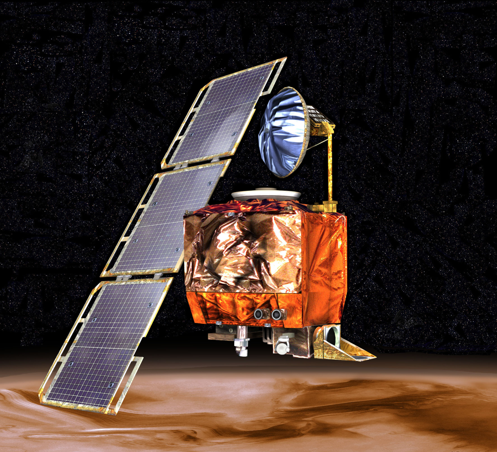
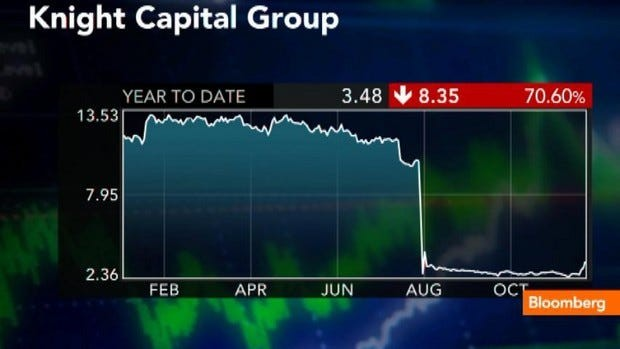
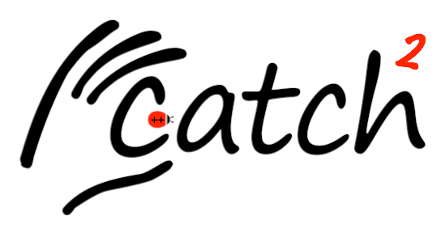
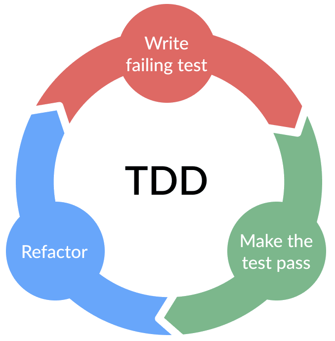

---

```yaml
layout: orientation
title: Orientation
highlight: Software Testing
training-event-only: true
```

---
layout: two-cols
---

# Mars Climate Orbiter (1999)


<v-clicks>

- The orbiter was lost due to an error in its navigation software
- Communication was lost as the spacecraft as it entered orbit
- Came in at the wrong altitude
- The root cause was a software error: a simple unit conversion error between metric and imperial
- No proper "checks and tests" were carried out on the responsible code
- This cost NASA roughly <span class="font-semibold text-red-700">$125 million</span>

</v-clicks>

::right::

<div class="h-full flex items-center justify-center pl-4">
  
</div>

---
layout: two-cols
---

# Knight Capital (2012)

<v-clicks>

- A deployment glitch in the trading system of Knight Capital, one of the largest US trading firms, led to a loss of roughly <span class="font-semibold text-red-700">$440 million</span> in 30 minutes
- New code was deployed just before the system went live
- One server still ran old code and produced incorrect stock purchase orders
- Small rollout mistakes can become catastrophic when software acts at scale

</v-clicks>

::right::

<div class="h-full flex items-center justify-center pl-4">
  
</div>

---

# Maintaining Legacy Code

<v-clicks class="space-y-1 text-2xl">

- Difficult to modify without breaking existing functionality
- We typically add tests to preserve functionality, then modify code with confidence!

</v-clicks>

<v-clicks>

<span class="font-semibold text-red-700 text-2xl">Without tests, we would be hesitant to change anything.</span>

</v-clicks>

<v-clicks class="space-y-1 text-2xl">

- Bugs become much more expensive to fix later in the software lifecycle
- One Microsoft study estimated 10-20 defects per 1000 lines of code
- Approximate cost to fix: 1-10-150 hours in design, development, and production

</v-clicks>

---

# Importance of Software Testing

<v-clicks class="space-y-1 text-2xl">

- Demonstrating that software produces the right results is critical
- Even if each line of code looks correct, errors can accumulate across a program
- Key questions to ask:
  - Does the software work as expected?
  - Can the correctness be verified independently?
  - How confident are we in the accuracy of the results?

</v-clicks>

<v-clicks class="space-y-1">

<span class="font-semibold text-red-700 text-2xl text-semibold">If we cannot answer those questions, the software's use is questionable</span>

</v-clicks>

---

# The Role of Automation in Software Testing

<v-clicks class="text-xl">

- Manual testing is <span class="font-semibold">necessary</span>
- However...
  - Prone to error
  - Can be time-consuming and expensive
  - Not scalable for large software systems

</v-clicks>

<v-clicks class="text-xl pt-4">

- <span class="font-semibold text-red-700 text-2xl pb-4">Automated testing means writing code that checks your software for you</span>
  - Computers are excellent at repetitive tasks
  - Define complex, repeatable processes with fewer errors
  - Reduces effort <u>in the long run</u>

</v-clicks>

<v-clicks class="text-xl pt-4">

- Automated testing should supplement manual testing, not replace it entirely

</v-clicks>

---

# Automated Testing

<v-clicks class="space-y-1 text-xl">

- **Unit tests**: check specific units of functionality for expected outputs from given inputs
- **Functional / integration tests**: Test functional paths through the code and interactions between components
- **Regression tests**: confirm that program output stays unchanged after modifications

</v-clicks>
<v-clicks class="space-y-1 text-2xl pt-4">

This course focuses on <span class="font-semibold">unit testing</span>, with the same principles applying to other types of tests.

</v-clicks>

---
layout: two-cols
---

# The defacto Standard for Python Testing: `pytest`

<v-clicks>

- In Python, `pytest` is a popular and robust testing framework
- Provides powerful features for test discovery and reporting
- Uses the `assert` statement to check for expected results
- Supports fixtures for setup and teardown of test environments
- Allows parameterization to run the same test with different inputs

</v-clicks>

<div v-click class="pt-4">

```console
$ pytest

```

</div>


::right::

<div class="h-full flex items-center justify-center">
  <!--  -->

```python {none|1-2|1-2|3-6|7-13|14-22|1-22}{at:1}
import pytest


def test_reversed():
    assert list(reversed([1, 2, 3])) == [3, 2, 1]


@ pytest.fixture
def sample_data():
    return [1, 2, 3]

def test_sum(sample_data):
    assert sum(sample_data) == 6


@pytest.mark.parametrize("input, expected", [
    ([1, 2], 3),
    ([3, 4], 7),
    ([5, 6], 11)
])
def test_sum_param(input, expected):
    assert sum(input) == expected

```

</div>
---
layout: two-cols
---

# Popular Frameworks for Other Languages

<v-clicks>

- Java: `JUnit`
- Fortran: `FRUIT`
- JavaScript: `Jest`
- C++: `Catch2`
- Rust: built-in test library
- Python: `pytest`
  - `unittest` is also built in

</v-clicks>

::right::

<div class="grid grid-cols-2 gap-4 place-items-center pt-6">
  
  
  
  
</div>

---
layout: two-cols
---

# Test-Driven Development

<v-clicks>

- Start by writing a failing test
- Write the smallest amount of code needed to make it pass
- Refactor once behaviour is protected by tests
- Repeat in short cycles

</v-clicks>

::right::

<div class="h-full flex items-center justify-center">
  
</div>

---

# Digging Deeper into Errors with Debugging

<v-clicks class="space-y-1 pb-8">

- Unit tests can detect problems and narrow down where to look...
- ...but *usually* do not explain the exact internal cause

</v-clicks>

<div class="space-y-1">

<ul>
  <li v-click>Some other useful techniques for narrowing down the source of errors:</li>
</ul>

<ol class="ml-8 list-decimal">
  <li v-click>Printing program state at key points</li>
  <li v-click>Using logging to trace execution with timestamps and configurable levels of detail</li>
  <li v-click>Examining intermediate files and outputs</li>
</ol>

</div>

<v-clicks class="space-y-1 pt-4">

- When that is not enough, a **debugger** can provide an in-depth exploration of the running code
  - Like explorative surgery, but for software
  - Allows you to step through code line by line, inspect variables, and understand the flow
</v-clicks>

---
layout: default
---

# Other Useful Techniques

<div class="grid grid-cols-2 gap-x-10 gap-y-8 pt-4">

<div>

### Defensive Programming

<v-clicks>

- Check that input data satisfies preconditions before continuing
- Raise an error when assumptions are violated instead of silently continuing
- In Python, type and shape checks are often especially useful

</v-clicks>

</div>

<div>

### Code Quality Checks

<v-clicks>

- Linters detect errors, inconsistencies, and style issues automatically
- They improve readability, maintainability, and consistency

</v-clicks>

</div>

<div class="col-span-2 mx-auto w-full max-w-3xl pt-2">

### Code Smells

<v-clicks>

- Code smells can signal deeper design issues even when code still runs
- Examples: oversized classes, long parameter lists, duplicated branches

</v-clicks>

</div>

</div>

---

# Limits to Testing

<ul>
  <li v-click>Testing effort should match the software's complexity and importance</li>
</ul>
<ul class="ml-8 pb-4 list-disc">
  <li v-click>Automated testing becomes more valuable as systems grow</li>
</ul>
<ul>
  <li v-click class="ml-8">Even strong unit test suites cannot catch every bug</li>
</ul>
<ul class="ml-8 list-disc">
  <li v-click class="ml-8">Manual testing and extensive testing with realistic data still matters</li>
</ul>

<span v-click class="text-lg font-semibold text-red-700">Tests do not guarantee bug-free software, but they reduce risk significantly</span>


---

```yaml
layout: questions
training-event-only: true
```

---

```yaml
src: ../../epilogue/main.md
training-event-only: true
```
